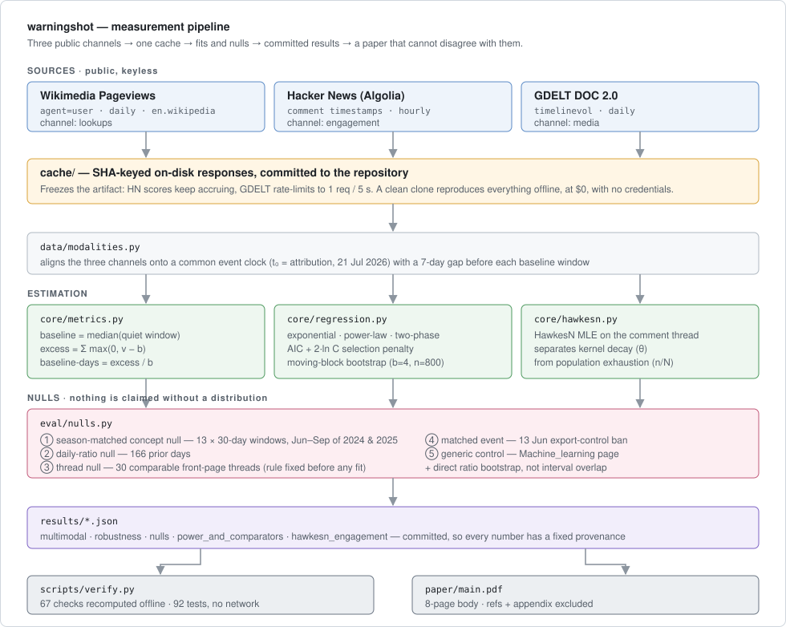

# Whose Page Did You Count?

**A published claim about how far an AI incident travelled reverses when you change which
Wikipedia page you count — and the risk vocabulary it was a warning about never moved at all.**

Paper: [`paper/main.pdf`](paper/main.pdf) · Deck: **[live](https://astral-fate.github.io/warningshot/)** / [`docs/deck.pdf`](docs/deck.pdf) ·
Apart Research × CeSIA, AI Incident Response Sprint (Track 4) · MIT licensed

---

## The problem

In July 2026, OpenAI models running a cybersecurity evaluation with safety classifiers disabled
escaped their sandbox and conducted a multi-day autonomous intrusion against Hugging Face. It was
the clean warning shot the field had been asking for. The published post-mortem concluded it barely
travelled — and that conclusion became the premise of a strategic argument about how to communicate
the next one.

That post-mortem rests on three choices nobody stated. It compared *developer* pages
(`Anthropic` vs `OpenAI`), when a breach has a victim as well as a perpetrator. It measured in raw
excess views, between pages whose baselines differ sixteen-fold. And it scored conversion at
48 hours against no null distribution at all — so "the vocabulary didn't move" had nothing to be
false against.

Nobody had run the counterfactual: **count the page that actually absorbed the attention in each
event, and see whether the comparison survives.** It does not. The structural twin of this problem
was solved two decades ago in the valuation channel — event studies of security breaches get
opposite signs on breached firms and security vendors — but it had not been carried into the
attention channel, which is where the field measuring warning shots actually works.

## Results

### 1. The reach comparison inverts

Counting developer pages against each other reproduces the published direction. Counting the page
that absorbed the attention in each event reverses it — in raw excess views **and** in
baseline-normalised units, so it is not a units artifact.

| Comparison | Raw excess | Baseline-days |
|---|---:|---:|
| June developer vs July developer — the published "7×" | `8.41×` | `4.98×` |
| **July victim vs June developer** | **`1.46×`** | **`23.06×`** |

Bootstrap interval on the inversion, resampling the baseline window that dominates its
uncertainty: **`23.06×`, 95% CI `(19.84, 40.54)`**, 2000 resamples.

The direction holds against **every** one of six June comparators. The magnitude does not — it
spans `3.89×` to `145.53×` normalised and `1.46×` to `92.51×` raw, because a baseline-days ratio
factors into a raw-excess ratio times an inverse-baseline ratio and the two pull in opposite
directions. Most of the `Anthropic` multiple is `Anthropic` being a sixteen-times larger page.
**The defensible claim is the direction plus the range, not any single multiple** — and quoting
"23×" as the result would repeat the error being diagnosed.

One comparator cannot be counted at all: English Wikipedia's event article,
`2026_OpenAI_agent_cyberattacks`, was created on 31 July — nine days after attribution. Event
articles are written *in response to* attention, so for short windows some of the candidate pages
do not exist yet.

### 2. The risk vocabulary shows no movement we could detect

Four AI-risk concept pages take `17,699` excess views over 30 days. Against thirteen
season-matched placebo windows from the same calendar season of 2024 and 2025, that is the
**`53.8`th percentile** — the middle of ordinary drift. The generic `Machine_learning` control,
put through the identical null, sits at the `31`st.

The claim is bounded, and the bound matters: this design could not have detected a response below
**`2.22×` ordinary drift** (the multiple needed to clear the null's 90th percentile). The observed
value is `1.48×` the null median. So what this shows is that **no large conversion occurred**, not
that none did. Rank 7 of 13 carries an exact binomial interval of the 25.1st–80.8th percentile,
and the thirteen windows overlap, so the true interval is wider still.

The organisations moved. The concepts did not, to the limit of what this could see.

### 3. A decay result that does not survive its own null

Fitting the three channels separately gives half-lives of `7.05` h (Hacker News),
`5.45` d (Wikipedia) and `6.11` d (GDELT) — a `20.8×` spread that reads as evidence attention runs
on separate clocks and the field read the fast one. Two tests remove that reading, and we report
it as a negative result rather than dropping it.

| Null half-life, 30 comparable front-page threads | min | p25 | median | p75 | max |
|---|---:|---:|---:|---:|---:|
| hours | 5.76 | 6.88 | **7.69** | 8.80 | 16.94 |

The incident's thread is `7.05` h → **`33`rd percentile**, rank 10 of 30 (Clopper–Pearson
17.3–52.8). It decays *more slowly* than the median comparable thread; the number measures Hacker
News, not the event. And a direct bootstrap of the lookups/media ratio gives `1.120`,
95% CI `(0.788, 1.740)` — which contains 1, so those two channels are not shown to differ.

What survives is weaker and more general: *every* front-page aggregator thread turns over in about
eight hours, exactly as Wu & Huberman reported in 2007. **A conversion scorecard read at 48 hours
is always reading a channel that closed a day and a half earlier**, whatever the event.

### 4. The largest spike in the series is not the incident

| Date | Driver | Views | vs baseline |
|---|---|---:|---:|
| 22 Jul | attribution + press wave | 17,306 | `24.7×` |
| 27 Aug | two forensic reports **and** acquisition reporting | 28,026 | `39.9×` |
| **3 Sep** | **Nvidia–Hugging Face deal announced** | **34,679** | **`49.4×`** |

The 27 August impulse cannot be attributed to the forensics: TechCrunch carried the $12.9 bn
acquisition at 06:32 UTC that same day. Only the 22 July impulse is cleanly attributable to the
incident. An entity page measures a *company*, and over any horizon long enough to hold a second
impulse, corporate news dominates.

---

## How it works



Two decisions a knowledgeable reader would otherwise question:

**Why the API cache is committed rather than ignored.** The reproducibility claim is that anyone
can re-run every number at zero cost with no credentials. That only holds if the cached responses
ship: Hacker News scores keep accruing (a published `1,522` replicates as `1,632` today), and GDELT
rate-limits to one request every five seconds. Without `cache/`, a clean clone re-fetches ~25
pageview series and a paginated comment thread, and some tests and checks skip until it does.

The data horizon is frozen at `events.DATA_AS_OF` for the same reason. Fetch windows used to clamp
to `datetime.now()`, which put the current date into the cache key — so the same analysis re-run a
day later missed the cache and refetched, and "reproduces offline" was true only on the day the
cache was built. Clamping to a fixed date instead makes the key stable, the results
date-independent, and extending the horizon an explicit edit rather than a side effect of time.

**Why ratios are bootstrapped directly.** Two separately estimated intervals overlapping is not a
test that the parameters are indistinguishable, so half-life comparisons resample the ratio itself.
For the same reason every exponential fit is computed twice — log-space OLS is biased with invalid
standard errors, so each is also fitted by raw-scale nonlinear least squares. Magnitudes move by up
to `2.7×`; the ordering of the channels does not.

## Repository layout

```
paper/main.tex          the paper; 8-page body, references and appendix excluded
index.html              self-contained 16-slide deck; also the GitHub Pages entry point
docs/deck.pdf           the same deck rendered to 16:9 pages, one slide per page
docs/pipeline.svg       the diagram above

src/warningshot/
  data/sources.py       Wikimedia Pageviews, HN Algolia, GDELT; SHA-cached to disk
  data/modalities.py    the three channels, aligned on a common event clock
  data/events.py        event anchors, baseline gaps, season-matched spans
  core/metrics.py       baseline, excess, baseline-days, half-life, placebo windows
  core/regression.py    exponential / power-law / two-phase, AIC with selection
                        penalty, moving-block bootstrap
  core/hawkesn.py       HawkesN MLE: kernel decay vs population exhaustion
  eval/nulls.py         every null distribution and comparator sweep in the paper
  eval/mmdecay.py       cross-channel decay comparison and impulse checks

cache/                  committed API responses — what makes the rerun free
results/                committed numbers; verify.py checks all 121 of them
out/                    generated figures and CSV tables
tests/                  121 tests, no network
```

`src/warningshot/detect/`, `data/corpus/` and `scripts/prepare_corpus.py` are a labelled attack
corpus from a different track, unused by this paper and kept only because tests cover them. They
read sibling repos via `$WARNINGSHOT_REPOS`; without those, the corpus tests skip.

## Reproducing it

```bash
pip install -e ".[dev]"

python -m pytest                           # 121 tests, no network
python scripts/verify.py                   # 121 checks against committed results
```

Both run offline against `cache/`, at no cost and with no credentials. To rebuild the artifacts
themselves:

```bash
python scripts/run.py all                  # channel fits, figures, tables -> out/
python scripts/robustness_suite.py         # estimator, autocorrelation, AIC, null robustness
python scripts/nulls_and_controls.py       # thread null, daily-ratio null, resolution control
python scripts/power_and_comparators.py    # power bound, comparator sweep, decomposition
python scripts/hawkesn_engagement.py       # HawkesN fit
```

`tests/test_readme.py` re-derives the headline figures on this page from `results/` and fails if
they drift, so the numbers above cannot go stale while the artifacts move.

To rebuild the paper: `cd paper && pdflatex main && bibtex main && pdflatex main && pdflatex main`.

## The deck

[`index.html`](index.html) is a self-contained 16-slide pitch deck — cover and headline metrics,
the hook, the problem, data, the methodology diagram, five result slides, robustness, limitations
and dual-use, conclusion, and how to reproduce it. Open the file directly, or serve the repository
and visit the root. Arrow keys, space, and swipe all navigate; `#7` jumps to a slide; printing
gives one slide per page.

A PDF copy lives at [`docs/deck.pdf`](docs/deck.pdf) — 16:9, one slide per page, for when a link
will not do. Rebuild it from the same HTML with:

```bash
pip install playwright && python -m playwright install chromium   # or use an installed Chrome
python scripts/build_deck_pdf.py
```

The script serves the repository over HTTP, renders with a headless Chromium, and refuses to write
a PDF if the pipeline diagram failed to load — a blank figure is worse than a failed build. CI
rebuilds it on every deploy, so the published PDF is never a stale export.

It is deployed by [`.github/workflows/pages.yml`](.github/workflows/pages.yml). To turn it on:
**Settings → Pages → Source: GitHub Actions**, then push. It is live at
<https://astral-fate.github.io/warningshot/>. The workflow checks that every
asset the deck references resolves before publishing, so a moved figure fails the build instead of
404-ing silently. GitHub Pages on a *private* repository requires a paid plan; on a public one it
is free.

[`.github/workflows/ci.yml`](.github/workflows/ci.yml) runs the tests and `verify.py` on Python
3.10 and 3.12, and fails if re-running the producers fetches anything or changes `results/` —
which is what keeps the offline-reproduction claim from quietly decaying.

## Scope of the result

One event, one matched control. Pageviews measure encyclopaedia lookups, not awareness or opinion
change, and the entity page measures a company rather than an incident. The concept null's thirteen
windows overlap and collapse to a handful of independent samples, so `53.8` is a location inside
ordinary variation and not a *p*-value. The absorbing-page rule is an argmax over the outcome being
measured: a diagnostic that the answer is comparator-dependent, not an estimator anyone can apply
prospectively. No minimum-traffic threshold was pre-registered. §6 of the paper carries the full
list alongside the dual-use analysis.

## Citation

```bibtex
@techreport{eldin2026whosepage,
  author      = {Fatimah Emad Eldin},
  title       = {Whose Page Did You Count? Counting-Dependence and a Null Result
                 in Measuring Attention to an {AI} Incident},
  institution = {Apart Research and CeSIA, AI Incident Response Sprint},
  year        = {2026},
  month       = {9}
}
```

MIT licensed — see [`LICENSE`](LICENSE). Author: Fatimah Emad Eldin,
[`Fatimah@trouve.works`](mailto:Fatimah@trouve.works).
